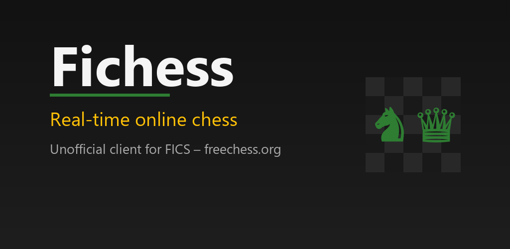
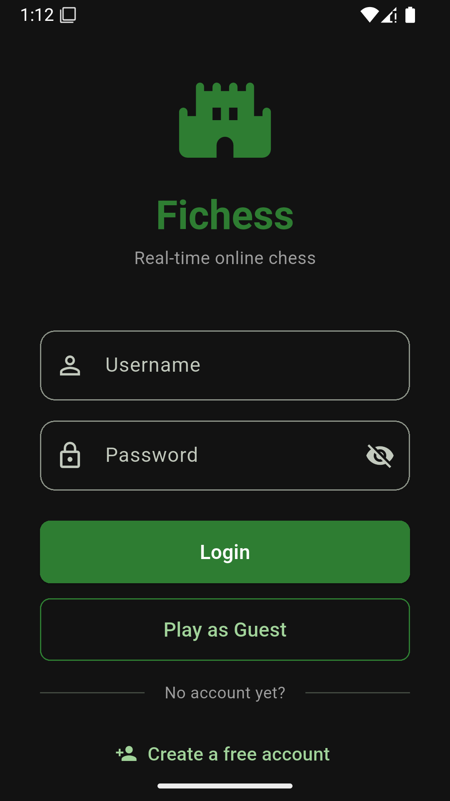
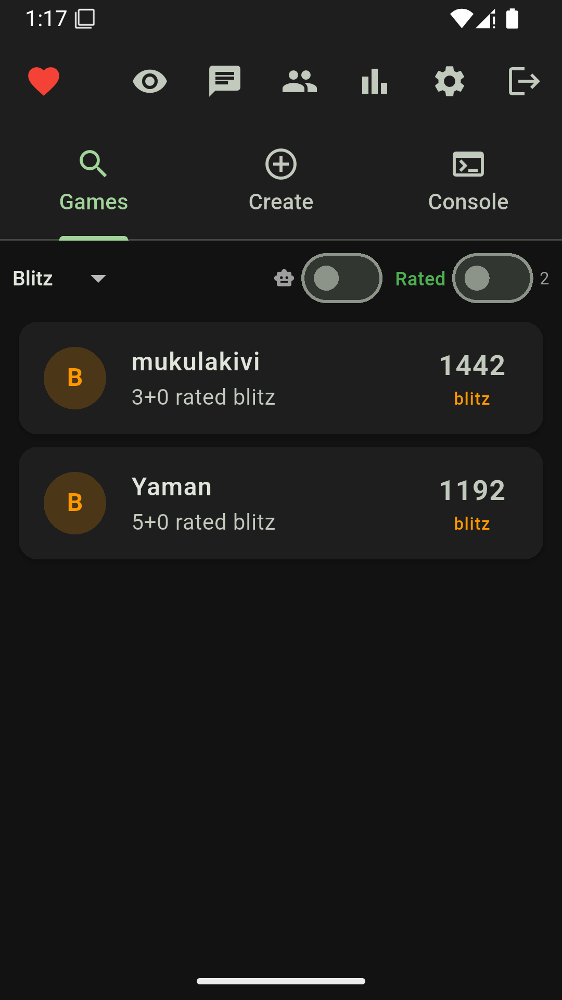
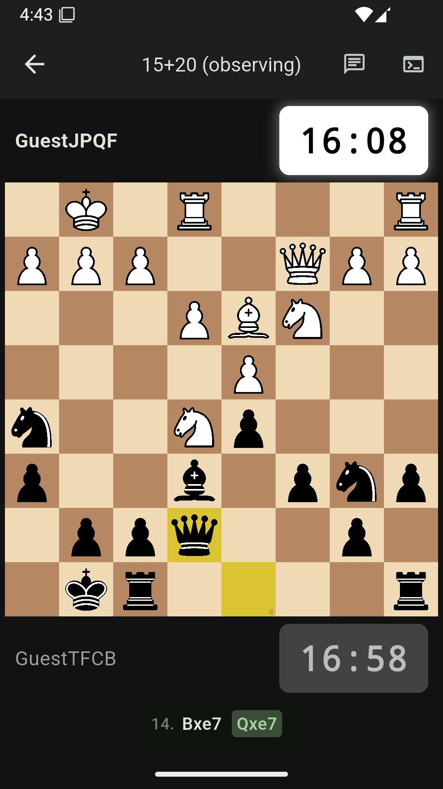
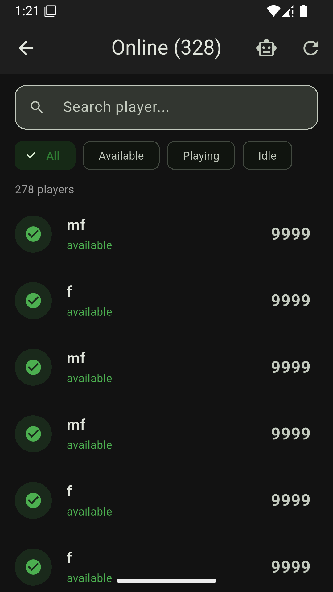
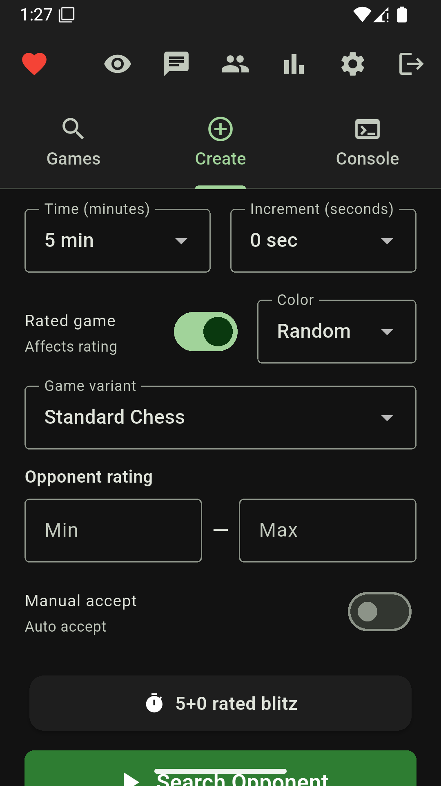
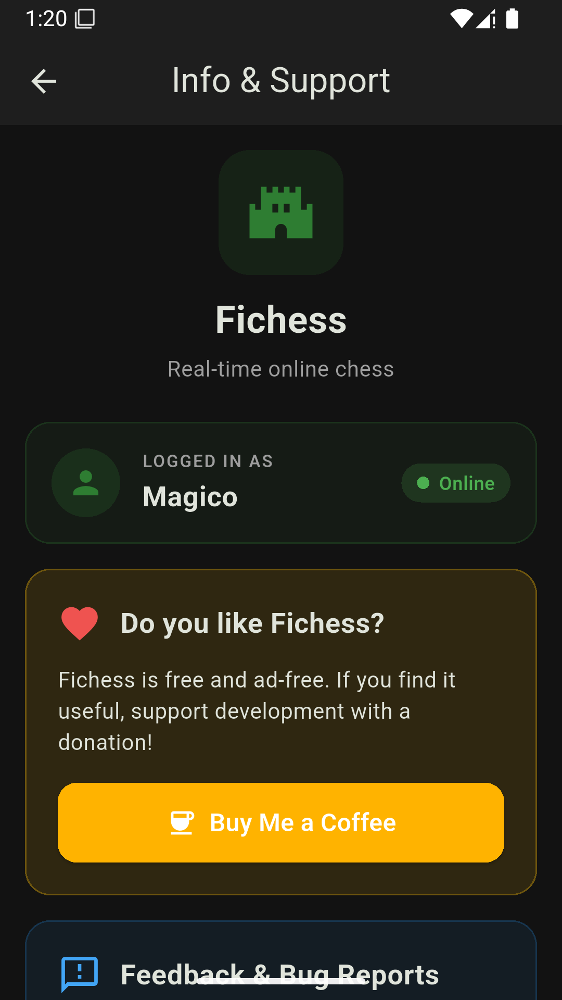

  

<h1 align="center">Fichess — Online Chess</h1>

  A modern mobile client for <strong>FICS</strong>, the Free Internet Chess Server. 
  Real-time chess against human opponents, for iOS and Android.

  <a href="#support">Support</a> ·
  <a href="PRIVACY.md">Privacy Policy</a> ·
  <a href="CHANGELOG.md">Changelog</a> ·
  <a href="https://github.com/thomascasali/fichess/issues">Report a bug</a>

---

## What is Fichess?

Fichess connects your phone to the **Free Internet Chess Server** ([freechess.org](https://www.freechess.org)),
a free chess community that has been running since 1995 with thousands of players
worldwide. It speaks the same protocol that desktop clients have used for decades,
wrapped in an interface designed for touch.

You can play as a guest without registering, or sign in with your existing FICS
account and keep your rating.

> **Fichess is an independent, unofficial client.** It is not affiliated with,
> operated by, or endorsed by FICS or the operators of freechess.org.
> See [About FICS](#about-fics) below.

## Screenshots

| Login | Lobby | Game |
|:---:|:---:|:---:|
|  |  |  |

| Players online | New game | Info |
|:---:|:---:|:---:|
|  |  |  |

## Features

**Playing**
- Rated and unrated games against real players
- Bullet, blitz and standard time controls
- Create a game with your own time, increment, colour, rating range and variant,
  or accept an existing offer from the list
- Premoves, takeback requests, draw offers, rematch
- Watch other people's games live, with filters by type and rating

**The board**
- Drag and drop with the piece lifted above your finger, so you can see the square
- Legal-move indicators, last-move and check highlighting
- Promotion with piece choice, or automatic queen
- 7 board themes and 3 piece sets

**Around the game**
- Player profiles with ratings, win/loss statistics and a rating trend chart
- Your full game history stored **on your device**, with replay — FICS itself only
  keeps the last few games
- Export your history as JSON, or a single game as PGN
- Chat: private messages, FICS channels, shouts, kibitz and whisper
- Online player list with quick challenge, and a filter to hide computer accounts

**Connection**
- Timeseal lag compensation, so your clock is not punished by a slow network
- Automatic keep-alive and reconnection

**Also**
- Full Italian and English interface, switchable instantly
- No advertising, no in-app purchases, no subscriptions
- No data is collected by the developer — see the [Privacy Policy](PRIVACY.md)

## Download

The app is currently in testing. Store links will be published here once it is
released.

- **iOS** — in review on the App Store
- **Android** — in testing on Google Play

## Getting started

1. Install the app.
2. Tap **Play as Guest** to start immediately, or sign in with your FICS username
   and password.
3. Don't have an account? Registration is free at
   [freechess.org](https://www.freechess.org) — you can also open the registration
   page from the login screen. Your password arrives by email.

## Support

Found a bug, or want to suggest something?

- **[Open an issue](https://github.com/thomascasali/fichess/issues/new/choose)** —
  the fastest way, and it helps other players too.
- **Email** — [casali.thomas@gmail.com](mailto:casali.thomas@gmail.com)

Please see [SUPPORT.md](SUPPORT.md) for what to include in a good bug report, and
for which problems belong to the FICS server rather than to this app.

> **Never post your FICS password**, in an issue or by email. Nobody will ever ask
> you for it.

## About FICS

The Free Internet Chess Server has been online since 1995 and is run entirely by
volunteers, on donated hardware and bandwidth, with no commercial interest.
If you enjoy playing there, consider supporting the people who keep it running.

Fichess references the FICS name with the **written permission of the FICS Head
Administrator**, granted on the understanding that this app is an unofficial
third-party client. Fichess is not an official FICS product, and the FICS
administrators are not responsible for it.

Problems with your FICS *account* — ratings, bans, registration, lost passwords —
are handled by the FICS administrators at
[freechess.org](https://www.freechess.org), not by this app.

## Credits

- **Cburnett** piece set — Colin M.L. Burnett (CC BY-SA 3.0)
- **Merida** piece set — Armando H. Marroquín
- **Timeseal** lag-compensation protocol — Henrik Gram
- **Free Internet Chess Server** — freechess.org

## A note on the source code

This repository contains the app's documentation, privacy policy and issue
tracker. **The application source code is not public.** Fichess is free to use,
but it is not an open-source project.

---

  © 2026 Thomas Casali · All rights reserved

